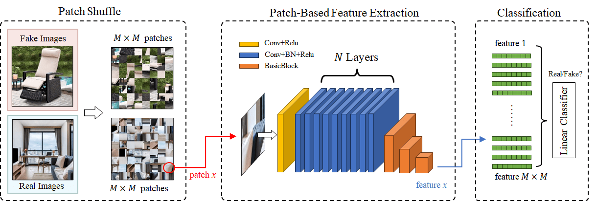

# Breaking Semantic Artifacts for Generalized AI-generated Image Detection



This repository contains code for *Breaking Semantic Artifacts for Generalized AI-generated Image Detection* (https://nips.cc/virtual/2024/poster/95403, **NeurIPS 2024**) by **Chende Zheng, Chenhao Lin∗, Zhengyu Zhao, Hang Wang, Xu Guo, Shuai Liu∗, Chao Shen**.

## Environment Setup

Our codebase requires the following Python:

+   Python >= 3.8.17
+   PyTorch >= 1.13.1

You can set up the environment by following these steps:

1.  Clone this repository

    ```shell
    git clone https://github.com/Zig-HS/FakeImageDetection.git
    cd FakeImageDetection
    ```

2.  Install the necessary libraries

    ```shell
    pip install -r requirements.txt
    ```

## Data Prepare

+   You can prepare your data through the following directory structure:

    ```
    datasets
    └── train					
          ├── gan
          │── dm   	
          │     .
          │     .
    └── val
          ├── gan
          │── dm   	
          │     .
          │     .
    └── test
          ├── progan
          │── cyclegan   	
          │     .
          │     .
    ```

+   Each directory (e.g., gan, progan) will contain real/fake images under `0_real` and `1_fake` folders respectively.

## Training

+   After prepareing the data, you can train the model with the following command:

    ```shell
    python train.py -j options/default.json
    ```

## Evaluation

+   You can evaluate the model on all the dataset included in `./datasets/test` or other folders by running:

    ```
    python eval.py -j default.json -r datasets/test
    ```

+   The results will be stored in `results/<model_name>.txt`, representing the Average Prevision and AUROC scores for each of the test domains.

